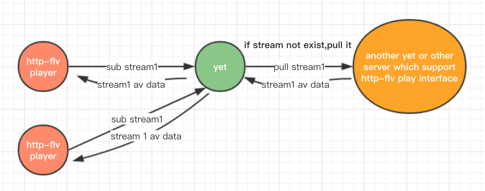
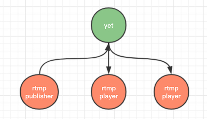

# Yet - a high-performance rtmp / http-flv server

9102, Am I starting write a rtmp / http-flv server yet, hah?

all star fork watch issue are welcome.

aim to make a high-performance, readable, maintainable, portable live-stream server.

### ready to roll

#### 1. sub http-flv, pull http-flv

sub by http-flv, pull http-flv from others (e.g. another yet or other server which support http-flv play interface) while stream not exist.

#### 2. broadcast rtmp

pub by rtmp, sub by rtmp, link them and broadcast av data.

### roadmap

TODO

### dep

all third party library are header-only, I've include them inside yet, which means we don't have to config or compile them, just using it directly.

* c++11 compiler
* asio
* spdlog

### env

```
OS X EI Capitan 10.11.6
Apple LLVM version 8.0.0 (clang-800.0.42.1)

Linux xxx 2.6.32-642.15.1.el6.x86_64 #1 SMP Fri Feb 24 14:31:22 UTC 2017 x86_64 x86_64 x86_64 GNU/Linux
gcc version 7.1.0 (GCC)
```

### benchmark

compare with  nginx-rtmp-module / srs / crtmpserver and other rtmp like server

### other




